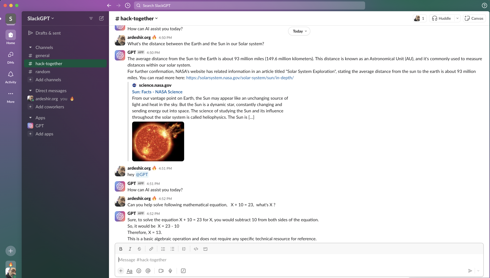
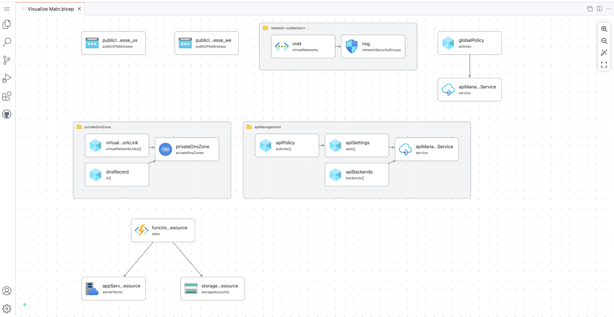

# SlackGPT






### C# code Azure Functions and Azure OpenAI API to generate text based on the provided prompt:

```
using Microsoft.AspNetCore.Mvc;  
using Microsoft.Azure.WebJobs;  
using Microsoft.Azure.WebJobs.Extensions.Http;  
using Microsoft.Extensions.Logging;  
using Newtonsoft.Json;  
using System.Net.Http;  
using System.Text;  
using System.Threading.Tasks;  
using System;  
  
namespace OpenAI  
{  
    public static class OpenAIFunction  
    {  
        [FunctionName("GenerateText")]  
        public static async Task<IActionResult> Run(  
            [HttpTrigger(AuthorizationLevel.Function, "post", Route = null)] HttpRequestMessage req,  
            ILogger log)  
        {  
            // Get the prompt from the request body  
            string prompt = await req.Content.ReadAsStringAsync();  
  
            // Prepare the API request body  
            var requestBody = new  
            {  
                prompt = prompt,  
                temperature = 0.7,  
                max_tokens = 4000,  
                top_p = 1,  
                frequency_penalty = 0,  
                presence_penalty = 0  
            };  
  
            // Retrieve the OpenAI API key from an environment variable  
            var openAiApiKey = Environment.GetEnvironmentVariable("OpenAI_API_Key");  
  
            // Prepare the API request  
            var client = new HttpClient();  
            var request = new HttpRequestMessage  
            {  
                Method = HttpMethod.Post,  
                RequestUri = new Uri("https://cdsazureopenai.eastus.azurecontainer.io/generate"),  
                Headers =  
                {  
                    { "Authorization", "Bearer " + openAiApiKey },  
                    { "Content-Type", "application/json" }  
                },  
                Content = new StringContent(JsonConvert.SerializeObject(requestBody), Encoding.UTF8, "application/json")  
            };  
  
            // Send the API request and parse the response  
            var response = await client.SendAsync(request);  
            var responseContent = await response.Content.ReadAsStringAsync();  
            dynamic responseObject = JsonConvert.DeserializeObject(responseContent);  
  
            // Return the generated text as the response  
            return new OkObjectResult(responseObject.choices[0].text);  
        }  
    }  
}  
  
 
```

In this example, we define an Azure Function named GenerateText that accepts HTTP POST requests and expects the provided prompt as a JSON string in the request body. The function then prepares a request to the Azure OpenAI API to generate text based on the prompt using the chatcodex deployment. The API request includes several parameters that control the text generation process, such as the temperature and maximum number of tokens. Once the API response is received, the function extracts the generated text and returns it as the HTTP response. Note that the OpenAI API key is stored as an environment variable for security purposes.

Replace {kv-openai-shared} with the name of your Azure Key Vault. This code uses the AzureServiceTokenProvider and KeyVaultClient classes to authenticate and retrieve the secret value from Key Vault. The retrieved value is then used to set the Authorization header in the API request.

```
using System;  
using System.Net.Http;  
using System.Threading.Tasks;  
  
namespace OpenAIAPITest  
{  
    class Program  
    {  
        static async Task Main(string[] args)  
        {  
            // Prompt to generate text for  
            string prompt = "You're an AI assistant that helps developers with code and software solutions.";  
  
            // API endpoint URL for the Azure Function  
            string apiUrl = "https://<function-app-name>.azurewebsites.net/api/GenerateText?code=<function-app-key>";  
  
            // Prepare the request body as a JSON object  
            var requestBody = new { prompt = prompt };  
  
            // Send the HTTP POST request to the Azure Function API  
            using (var client = new HttpClient())  
            {  
                var response = await client.PostAsJsonAsync(apiUrl, requestBody);  
                response.EnsureSuccessStatusCode();  
  
                // Extract the generated text from the API response  
                var generatedText = await response.Content.ReadAsStringAsync();  
  
                // Print the generated text to the console  
                Console.WriteLine(generatedText);  
            }  
        }  
    }  
}  
```

In this example, we define a console application that first sets the prompt to generate text for, and then constructs the API endpoint URL for the GenerateText function in Azure Functions. We then prepare the request body as a JSON object containing the prompt, and send an HTTP POST request to the API endpoint using the PostAsJsonAsync method of the HttpClient class. Finally, we extract the generated text from the API response and print it to the console. (Note that you will need to replace <function-app-name> and <function-app-key> with the actual values for your Azure Function app.)

# Pre reqs

Add the required NuGet packages for Azure Functions to work, you can use the following dotnet command in the terminal or command prompt:

- dotnet add package Microsoft.Azure.Functions.Extensions --version 1.1.0  

This will add the Microsoft.Azure.Functions.Extensions package to your project, which provides the necessary extensions for developing Azure Functions using .NET. You may also need to add other packages depending on the specific functionality you require, such as the Microsoft.Azure.WebJobs.Extensions.Http package for handling HTTP requests.

The PostAsJsonAsync method is defined in the HttpClient class by default. It is provided by the System.Net.Http.Json namespace, which is part of the Microsoft.AspNet.WebApi.Client NuGet package. Add this package to your project using the following dotnet command:

- dotnet add package Microsoft.AspNet.WebApi.Client --version 5.2.7  
 
- dotnet add package Microsoft.Azure.WebJobs.Extensions.Http --version 3.0.11  


### Bicep IaC

Bicep script that provisions an Azure Function App, an Azure Storage account, and an Azure Cognitive Services account for integrating with the Azure OpenAI API:

```
param location string = 'eastus'  
param functionAppName string  
param storageAccountName string  
param cognitiveServicesAccountName string  
param skuName string = 'F0'  
  
resource storageAccount 'Microsoft.Storage/storageAccounts@2021-04-01' = {  
  name: storageAccountName  
  location: location  
  kind: 'StorageV2'  
  sku: {  
    name: skuName  
  }  
  encryption: {  
    services: {  
      file: {  
        enabled: true  
      }  
      blob: {  
        enabled: true  
      }  
    }  
    keySource: 'Microsoft.Storage'  
  }  
}  
  
resource cognitiveServicesAccount 'Microsoft.CognitiveServices/accounts@2021-06-01-preview' = {  
  name: cognitiveServicesAccountName  
  location: location  
  sku: {  
    name: 'S0'  
  }  
  kind: 'TextAnalytics'  
}  
  
resource functionApp 'Microsoft.Web/sites@2021-02-01' = {  
  name: functionAppName  
  location: location  
  kind: 'functionapp'  
  properties: {  
    serverFarmId: resourceGroup().id + '/providers/Microsoft.Web/serverfarms/appserviceplan'  
    siteConfig: {  
      appSettings: [  
        {  
          name: 'AzureWebJobsStorage'  
          value: 'DefaultEndpointsProtocol=https;AccountName=${storageAccountName};AccountKey=${listKeys(storageAccount.id, storageAccount.apiVersion).keys[0].value};EndpointSuffix=core.windows.net'  
        }  
        {  
          name: 'FUNCTIONS_EXTENSION_VERSION'  
          value: '~3'  
        }  
        {  
          name: 'OpenAI_API_KEY'  
          value: '<your-openai-api-key>'  
        }  
      ]  
    }  
    httpsOnly: true  
  }  
  dependsOn: [  
    storageAccount  
    cognitiveServicesAccount  
  ]  
}  
  
output endpoint string = functionApp.properties.defaultHostName  

```
 
This Bicep script creates an Azure Storage account, an Azure Cognitive Services account, and an Azure Function App with the necessary configuration to integrate with the Azure OpenAI API. You will need to replace <your-openai-api-key> with your actual API key.

The script takes several parameters, including the location to provision resources in, the names of the storage account, cognitive services account, and function app, and the SKU name for the storage account. The output of the script is the endpoint URL for the function app.

Note that this script assumes that you have already created an Azure App Service plan named appserviceplan in your resource group. If you haven't done so yet, you will need to create this resource separately before deploying this script.

Updated Bicep script that creates an Azure Function App, an Azure Storage account, and an Azure Cognitive Services account, all running in an App Service Plan that is integrated with a virtual network and has access to a Key Vault:

```
param location string = 'eastus'  
param resourceGroupName string  
param appServicePlanName string  
param functionAppName string  
param storageAccountName string  
param cognitiveServicesAccountName string  
param skuName string = 'F0'  
param vnetName string  
param subnetName string  
param keyVaultName string  
param keyVaultSecretName string  
param appIdObjectId string  
param storageAccountResourceId string  
  
resource storageAccount 'Microsoft.Storage/storageAccounts@2021-04-01' = {  
  name: storageAccountName  
  location: location  
  kind: 'StorageV2'  
  sku: {  
    name: skuName  
  }  
  encryption: {  
    services: {  
      file: {  
        enabled: true  
      }  
      blob: {  
        enabled: true  
      }  
    }  
    keySource: 'Microsoft.Storage'  
  }  
}  
  
resource cognitiveServicesAccount 'Microsoft.CognitiveServices/accounts@2021-06-01-preview' = {  
  name: cognitiveServicesAccountName  
  location: location  
  sku: {  
    name: 'S0'  
  }  
  kind: 'TextAnalytics'  
}  
  
resource appServicePlan 'Microsoft.Web/serverfarms@2021-02-01' = {  
  name: appServicePlanName  
  location: location  
  sku: {  
    name: 'Y1'  
    tier: 'Dynamic'  
    size: 'Y1'  
  }  
  properties: {  
    virtualNetworkProfile: {  
      id: resourceId('Microsoft.Network/virtualNetworks/subnets', vnetName, subnetName)  
    }  
    keyVaultReferenceIdentity: {  
      userAssignedIdentities: [  
        appIdObjectId  
      ]  
    }  
    userAssignedIdentities: {  
      [appIdObjectId]: {  
        principalId: reference(appIdObjectId, '2018-11-30-preview', 'Full').principalId  
      }  
    }  
  }  
}  
  
resource functionApp 'Microsoft.Web/sites@2021-02-01' = {  
  name: functionAppName  
  location: location  
  kind: 'functionapp'  
  properties: {  
    serverFarmId: appServicePlan.id  
    siteConfig: {  
      appSettings: [  
        {  
          name: 'AzureWebJobsStorage'  
          value: 'DefaultEndpointsProtocol=https;AccountName=${storageAccountName};AccountKey=${listKeys(storageAccount.id, storageAccount.apiVersion).keys[0].value};EndpointSuffix=core.windows.net'  
        }  
        {  
          name: 'FUNCTIONS_EXTENSION_VERSION'  
          value: '~3'  
        }  
        {  
          name: 'OpenAI_API_KEY'  
          value: '@Microsoft.KeyVault(SecretUri=https://${keyVaultName}.vault.azure.net/secrets/${keyVaultSecretName}/)'  
        }  
      ]  
    }  
    httpsOnly: true  
  }  
  dependsOn: [  
    storageAccount  
    cognitiveServicesAccount  
    appServicePlan  
  ]  
}  
  
resource appServicePlanIdentity 'Microsoft.Web/serverfarms/providers/roleAssignments@2021-04-01-preview' = {  
  name: guid(appServicePlanName)  
  properties: {  
    roleDefinitionId: '/subscriptions/${subscription().subscriptionId}/providers/Microsoft.Authorization/roleDefinitions/0c4e7efe-5c83-4370-b6c5-6e6b6a8c7f3a' // Contributor role  
    principalId: appServicePlan.identity.principalId  
    scope: resourceGroup().id  
  }  
}  
  
resource storageAccountIdentity 'Microsoft.Storage/storageAccounts/providers/roleAssignments@2021-04-01-preview' = {  
  name: guid(storageAccountName)  
  properties: {  
    roleDefinitionId: '/subscriptions/${subscription().subscriptionId}/providers/Microsoft.Authorization/roleDefinitions/b7e6dc6d-f1e8-4753-8033-0f276bb0955b' // Storage Blob Data Contributor role  
    principalId: appServicePlan.identity.principalId  
    scope: storageAccountResourceId  
  }  
}  
  
output endpoint string = functionApp.properties.defaultHostName  
```

This Bicep script extends the previous one to also create an App Service Plan that is integrated with a virtual network, has access to a Key Vault, and has permissions to access the storage account. It assumes that you have already created the virtual network, subnet, and Key Vault in your resource group, and that you have already granted the App Service Plan the necessary permissions to access the Key Vault and storage account.

The script takes several parameters, including the location to provision resources in, the names of the resource group, app service plan, function app, storage account, and cognitive services account, the SKU name for the storage account, the names of the virtual network, subnet, and Key Vault, the name of the Key Vault secret containing the OpenAI API key, the object ID of the managed identity associated with the App Service Plan, and the resource ID of the storage account.

The output of the script is the endpoint URL for the function app. Note that you may need to make additional changes to this script based on your specific environment and requirements.


Description of each parameter and where you can find or set their values:

- *location*: The Azure region where the resources will be created. 
- *resourceGroupName*: The name of the resource group where the resources will be created. You can create a new resource group or use an existing one.
- *appServicePlanName*: The name of the App Service Plan that will host the Azure Function App. 
- *functionAppName*: The name of the Azure Function App that will be created. 
- *storageAccountName*: The name of the Azure Storage account that will be created. 
- *cognitiveServicesAccountName*: The name of the Azure Cognitive Services account that will be created. 
- *skuName*: The SKU name of the Azure Storage account. The default value is F0.
- *vnetName*: The name of the virtual network where the App Service Plan will be deployed. 
- *subnetName*: The name of the subnet where the App Service Plan will be deployed. 
- *keyVaultName*: The name of the Key Vault that will be used to store the OpenAI API key. 
- *keyVaultSecretName*: The name of the secret in the Key Vault that contains the OpenAI API key. 
- *appIdObjectId*: The object ID of the managed identity that will be associated with the App Service Plan. You can find the object ID in the Azure portal or using the Azure CLI or PowerShell.
- *storageAccountResourceId*: The resource ID of the Azure Storage account. You can find the resource ID in the Azure portal or using the Azure CLI or PowerShell.

Note that some of these parameters require pre-created resources, such as the virtual network, subnet, Key Vault, and managed identity. You will need to create these resources separately before deploying this Bicep script.

To get the object ID of the managed identity, you can use the following Azure CLI command:

```
az identity show -g <resource-group-name> -n <managed-identity-name> --query principalId -o tsv
``` 
 
To get the secret value from the Key Vault, you can use the following Azure CLI command:
``` 
az keyvault secret show --name <secret-name> --vault-name <keyvault-name> --query value -o tsv 
```  
 
Replace *<resource-group-name>, <managed-identity-name>, <secret-name>, and <keyvault-name>* with the appropriate values for your environment.

The recommended way to access Key Vault secrets from a function is to use the Azure.Identity library. This library allows for flexible authentication options, including managed identities for Azure resources, service principals, and shared access signatures.

## Here's a guide to accessing Key Vault secrets from an Azure Function with Azure.Identity library:

1. Ensure that you have a Key Vault created and secrets in it.

2. Install the Azure.Identity nuget package in your project.

3. Set up an Azure Managed Identity in the Azure portal or create a Service Principal and store its client Id and client secret.

4. In your function, create an instance of the `DefaultAzureCredential` class from the Azure.Identity library:

```
using Azure.Identity;
using Azure.Core;

var credential = new DefaultAzureCredential();
```

5. Use the `GetSecretAsync` method from the `SecretClient` class to get the secret value:
```
using Azure.Security.KeyVault.Secrets;

var secretUri = new Uri("https://{key-vault-name}.vault.azure.net/secrets/{secret-name}/{version}");
var client = new SecretClient(secretUri, credential);
KeyVaultSecret secret = null;
try
{
  secret = await client.GetSecretAsync(secretUri);
}
catch (RequestFailedException ex)
{
  Console.WriteLine($"Error getting secret: {ex.Message}");
}

// retrieve the secret value
var secretValue = secret.Value;
```
6. dotnet add package Azure.Identity --version 1.10.0

Make sure to replace `{key-vault-name}` with the name of your Key Vault and `{secret-name}` with the name of the secret you want to retrieve. You can optionally specify a version of the secret by appending its version number to the secret URL, separated by a slash.